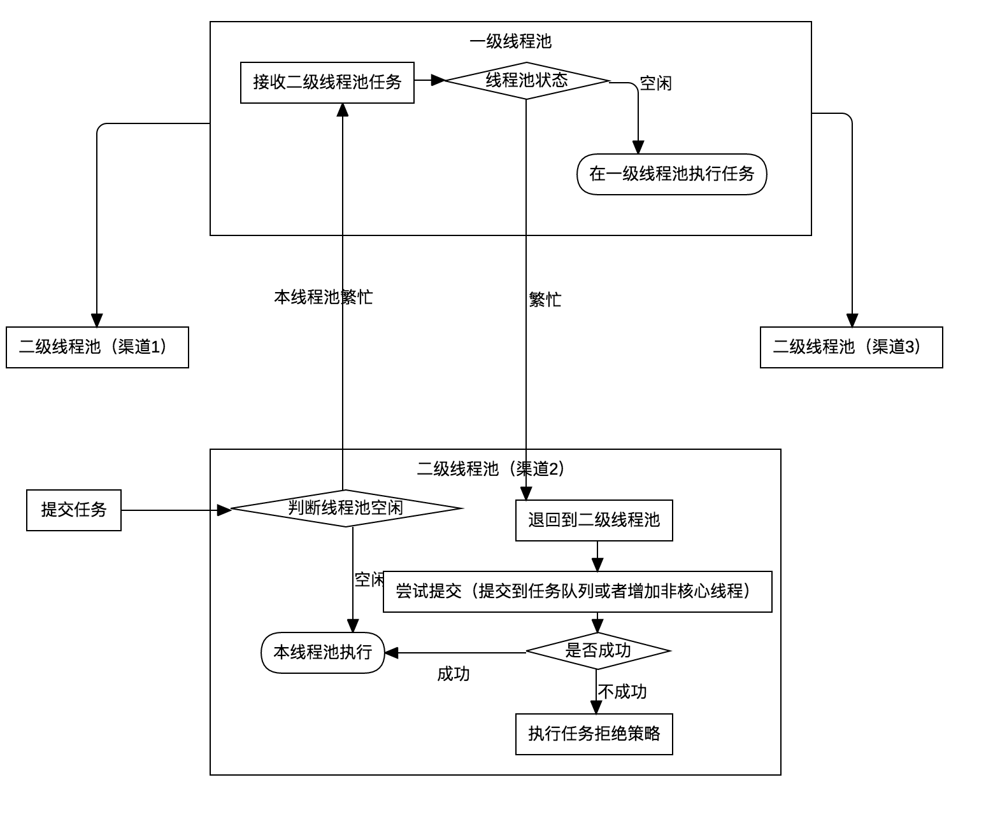
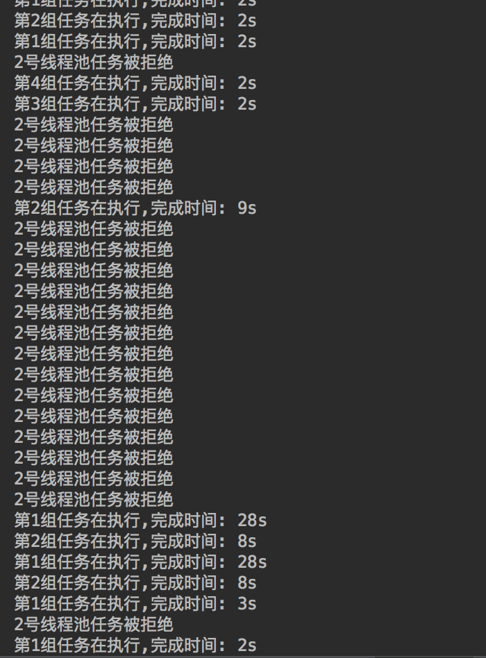

# j2executor
j2executor是对java原生的线程池的一个包装,最初主要是为了提供二级线程池模型。下面描述二级线程池的使用场景

## 解决问题
我们在实现业务逻辑的时候,经常有分支任务的场景出现,我们可以将多个不相关的任务放到多个线程池中并发执行,然后等待所有分支执行完成,归并结果。由于并发处理分支,可以减少请求处理时间。
但是这也带来了问题,由于是异步任务,任务提交到线程池,可能并没有立即执行她(由于线程池本身设置,任务可能需要排队),这样反而会导致任务被拖慢。

同时,由于排队问题,一个任务能否马上执行,还取决于其他任务是否占用了太多线程池资源。由于"其他任务"不可靠性,我们常常实现了``线程池隔离``,
我们希望各个核心渠道的任务单独在各自的线程池里面执行,避免某些渠道任务突然爆发(突然爆发很大可能出现故障,如请求处理不成功,上游大量重试,请求量翻倍)而导致其他渠道任务收到影响。

但是有了线程池隔离之后,又出现了新的问题。就是我们需要为每个渠道配置各自的线程参数,如果配置不合理,要么资源浪费(大量空转)、要么某些渠道请求量大导致任务阻塞、最主要是线程隔离之后
每种类型的任务都被限制使用固定的资源导致因对突发能力变弱了(如果是一个总线程池,那么流量突发可以有更多的线程资源使用,隔离后无法做到这点了)。

所以,为了解决手动拍脑门儿设置线程池可能的风险,以及提高应对流量突发能力。我大概设计了这个二级线程池结构。

## j2executor结构


j2executor处理了任务溢出问题,能够在一定程度上抵御流量突发,同时保证各个业务的任务隔离(即使流量突发也不会影响其他业务导致整个系统被拖垮),另外j2executor还可以抵御``线程池隔离``时各个业务设置不合理导致的资源分配不均,任务阻塞或者空转问题。

## 使用demo
```
/**
 * Created by virjar on 2018/2/25.<br>
 * 使用范例
 */
public class J2ExecutorTest {
    public static void main(String[] args) {
        // 业务线程池
        // 1号线程池,使用LinkedBlockingDeque,不会拒绝任务,但是当任务堵塞的时候,将会导致超时
        ThreadPoolExecutor pool1 = new ThreadPoolExecutor(2, 3, 0L, TimeUnit.MILLISECONDS,
                new LinkedBlockingDeque<Runnable>(), new PrintLogRejectHandler("1号线程池"));

        // 2号线程池,使用ArrayBlockingQueue,任务会被拒绝,将会打印日志
        ThreadPoolExecutor pool2 = new ThreadPoolExecutor(2, 3, 0L, TimeUnit.MILLISECONDS,
                new ArrayBlockingQueue<Runnable>(10), new PrintLogRejectHandler("2号线程池"));

        // 1、2号线程池,她们的任务都会被提交到一级线程池进行执行(在各自的线程池繁忙的时候),用来抵御流量突发问题

        // 3号线程池,使用LinkedBlockingDeque,任务提交速度小于消费速度,线程池处于正常状况
        ThreadPoolExecutor pool3 = new ThreadPoolExecutor(2, 3, 0L, TimeUnit.MILLISECONDS,
                new LinkedBlockingDeque<Runnable>(), new PrintLogRejectHandler("3号线程池"));

        // 4号线程池,ArrayBlockingQueue,任务提交速度小于消费速度,线程池处于正常状况
        ThreadPoolExecutor pool4 = new ThreadPoolExecutor(2, 3, 0L, TimeUnit.MILLISECONDS,
                new ArrayBlockingQueue<Runnable>(10), new PrintLogRejectHandler("4号线程池"));

        final List<ThreadPoolExecutor> pools = new ArrayList<>();
        pools.add(pool1);
        pools.add(pool2);
        pools.add(pool3);
        pools.add(pool4);
        // 使用两级线程池关联各个业务线程池
        new J2Executor(new ThreadPoolExecutor(20, 30, 0L, TimeUnit.MILLISECONDS, new ArrayBlockingQueue<Runnable>(10)))
                .registrySubThreadPoolExecutors(pools);

        // 启动四个任务,同时往各自线程池丢任务
        for (int i = 0; i < pools.size(); i++) {
            new WorkThread(pools.get(i), (i + 1)).start();
        }

    }

    private static class WorkThread extends Thread {
        private ThreadPoolExecutor poolExecutor;
        private int index;

        public WorkThread(ThreadPoolExecutor poolExecutor, int index) {
            this.poolExecutor = poolExecutor;
            this.index = index;
        }

        @Override
        public void run() {
            for (int i = 0; i < 100000; i++) {
                final long startTimestamp = System.currentTimeMillis();
                poolExecutor.submit(new Runnable() {
                    @Override
                    public void run() {
                        // 每个任务执行2s
                        try {
                            Thread.sleep(2000);
                        } catch (InterruptedException e) {
                            e.printStackTrace();
                        }
                        System.out.println("第" + index + "组任务在执行,完成时间: "
                                + (System.currentTimeMillis() - startTimestamp) / 1000 + "s");
                    }
                });

                // 第1、2组任务,直接打满,其他任务,每隔3s投递一个任务
                long sleepTime;
                if (index == 1 || index == 2) {
                    sleepTime = 50;
                } else {
                    sleepTime = 1500;
                }

                try {
                    Thread.sleep(sleepTime);
                } catch (InterruptedException e) {
                    e.printStackTrace();
                }

            }
            poolExecutor.shutdown();
        }
    }

    private static class PrintLogRejectHandler implements RejectedExecutionHandler {
        private String tag;

        public PrintLogRejectHandler(String tag) {
            this.tag = tag;
        }

        @Override
        public void rejectedExecution(Runnable r, ThreadPoolExecutor executor) {
            System.out.println(tag + "任务被拒绝");
        }
    }
}
```

## 测试效果

其中,
1. 一号线程池,流量突发,使用的是缓存任务策略,所以任务不丢弃,但是将会导致任务超时严重。
2. 二号线程池,流量突发,使用的是丢弃策略,将会导致任务被拒绝,有部分任务在队列里面缓存(10个),超时相对较少
3. 三号和四号,流量正常,任务能够正常执行。
4. 一号和二号的流量突发,并不会影响三号四号任务,她们总是在2s内执行成功
5. 依靠一级线程池,处理了部分一号和二号线程池溢出的任务。

## 参数设置建议
建议平常一级线程池容量大一些,二级线程池容量小一些,大部分情况二级线程池都是可以溢出的。这样能够尽量利用资源,抗突发流量能力也强大一些。二级线程池主要保证独立业务能够不受大的影响即可。